<div align="center">
  
</div>

<br/>

<p align="center">
  
  &nbsp;
  
  &nbsp;
  
  &nbsp;
  
</p>

<div align="center">

```
━━━━━━━━━━━━━━━━━━━━━━━━━━━━━━━━━━━━━━━━━━━━━━━━━━━━━━━━━━━━━━━━━━━
```

</div>

## `> LANGUAGES`

<p>
  
  
  
  
  
  
  
</p>

## `> FRAMEWORKS & LIBRARIES`

<p>
  
  
  
  
  
</p>

## `> TOOLS & PLATFORMS`

<p>
  
  
  
  
  
</p>

## `> CLOUD & DEPLOYMENT`

<p>
  
  
  
  
</p>

<div align="center">

```
━━━━━━━━━━━━━━━━━━━━━━━━━━━━━━━━━━━━━━━━━━━━━━━━━━━━━━━━━━━━━━━━━━━
```

</div>

## `> GITHUB STATS`

<p align="center">
  
  
</p>

<p align="center">
  
</p>

## `> ACTIVITY`

<p align="center">
  
</p>

<div align="center">

```
━━━━━━━━━━━━━━━━━━━━━━━━━━━━━━━━━━━━━━━━━━━━━━━━━━━━━━━━━━━━━━━━━━━
```

</div>

## `> CONNECT`

<p align="center">
  <a href="https://www.linkedin.com/in/asfand-khan-7a8a971aa/">
    
  </a>
  <a href="mailto:Asfand0306@gmail.com">
    
  </a>
  <a href="https://myportfolio-zeta-seven-97.vercel.app/">
    
  </a>
</p>

<div align="center">

```
━━━━━━━━━━━━━━━━━━━━━━━━━━━━━━━━━━━━━━━━━━━━━━━━━━━━━━━━━━━━━━━━━━━
```

<sub>⭐️ From <a href="https://github.com/Asfand0306">Asfand0306</a></sub>

</div>
